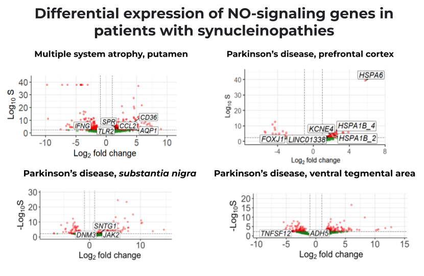
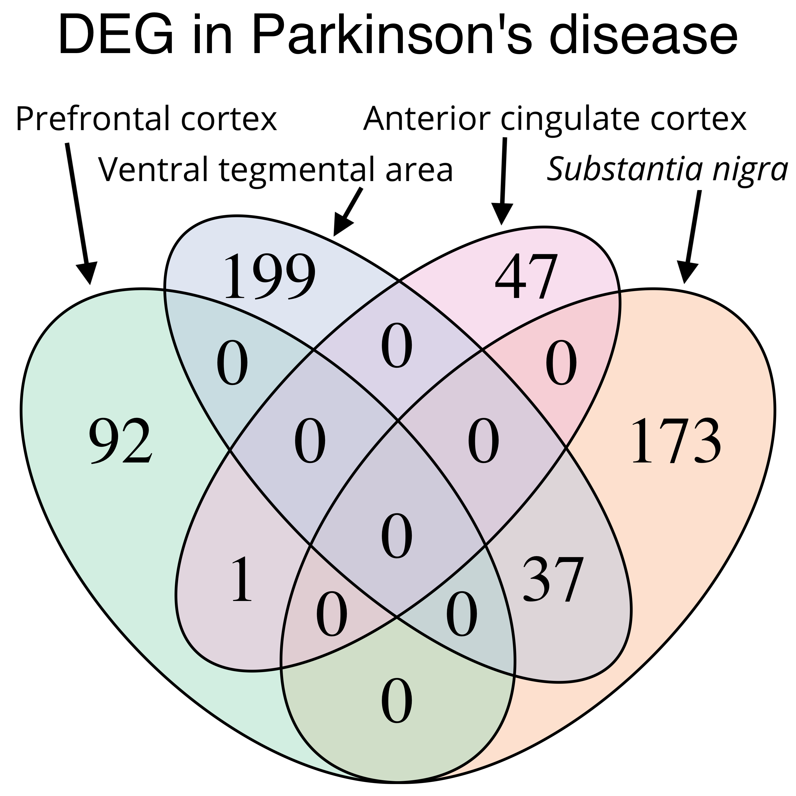

## Analysis of differential expression of genes involved in NO-signaling in synucleinopathies
Authors: 

- Anna Kapitonova
- Alexandra Livanova 
- Stanislav Bondarev

### Introduction
Synucleinopathies are neurodegenerative diseases that include Parkinson's disease, multiple system atrophy, and dementia with Lewy bodies (Coon & Singer, 2020). During pathogenesis, protein aggregates, in particular, alpha-synuclein, are formed in brain neurons, which leads to loss of control of movements in patients. According to bioinformatic predictions, NOS1AP is also capable of forming protein aggregates in neurons and directly interacts with alpha-synuclein. Based on this, the hypothesis emerged, that NO signaling could be involved in the pathogenesis of synucleinopathies.

### Aim, tasks and data
The **aim** of this project was to to evaluate changes in expression level of NO-signaling genes in brain samples from patients with synucleinopathies.

The following **tasks** were set in order to achive the goal:

1. To assess differential expression of NOS1AP and other genes of NO-signaling in brain tissues of patients with synucleinopathies
2. To compare sets of differentially expressed genes in different brain regions of patients with synucleinopathies

The **available data** at the start of the project were four open RNA-seq datasets of raw reads from different brain tissues of patients with synucleinopathies: 
- SRP058181 - Brodmann area, prefrontal cortex, 42 control, 29 Parkinson's disease (Dumitriu et al., 2016)
- SPR148970 - substantia nigra and ventral tegmental area midbrain dopamine neurons, 18 control, 5 Parkinson’s disease
- SRP215213 - putamen, 12 control, 10 multiple system atrophy (data not published)
- SRP324001 - anterior cingulate cortex, 7 control, 7 dementia with Lewy bodies, 7 Parkinson’s disease, 7 Parkinson’s disease with dementia

### Workflow

The workflow of the project is discussed below.

#### Preparing the raw reads
Raw reads in fastq format were downloaded to the server with SRA toolkit. The quality of raw reads was assessed in [FastQC](https://www.bioinformatics.babraham.ac.uk/projects/fastqc/) and summary reports were created in [MultiQC](https://multiqc.info/):

[1_download_data_and_QC.sh](./1_download_data_and_QC.sh)

#### Alignment
STAR alignment against GRCh38 human genome was performed with resulting bam files and genecounts option:

[2_alignment_to_reference.sh](./2_alignment_to_reference.sh)

#### Variant calling & filtering
mpileup was computed for sorted .bam files against GRCh38 human genome, followed by bcftools calling to generate .bcf files. Resulting .bcf files were filtered to obtain SNPs in SNCA, LRRK2, GBA, PRKN genes only:

[3_variant_calling.sh](./3_variant_calling.sh)

#### Constructing table with counts
For each dataset a table with counts was constructed with R script from ReadsPerGene.out.tab files obtained after STAR alignment. Second columns corresponding to counts for non-stranded libraries were used. Two protocols were provided for technical replicates (if any), where they were summarized or averaged.

#### PCA & DE analysis
PCA using rlog transformation was performed to check the clustarization of groups and quality of replicates. DEseq2 was used to perform differential expression analysis. Lof2FoldChange was corrected with apeglm, thresholds for significant DE: s-value < 0.005, |lfc| > 1.

- [SRP058181_count_table&DEA.R](./SRP058181_count_table&DEA.R)
- [SRP215213_count_table&DEA.R](./SRP215213_count_table&DEA.R)
- [SRP148970_count_table&DEA.R](./SRP148970_count_table&DEA.R)
- [SRP324001_count_table&DEA.R](./SRP324001_count_table&DEA.R)

#### Gene enrichment
Lists of genes with significantly changed expression were obtained and uploaded to Gene Ontology, gsea and kobas databases to find out main signaling pathways upregulated and downregulated in synucleinopathies.

#### NOS1AP gene expression
Table of normalized counts was obtained after correction for library size for each of four datasets. Normalized counts for NOS1AP were compared in controls and patients with Parkinson's disease (Mann-Whitney test) in GraphPrism 8 software (http://www.graphpad.com/faq/viewfaq.cfm?faq=1362).

#### Finding genes of NO signaling differentially expressed in synucleinopathies
The list of GO terms with 'nitric oxide' keyword was used to obtain the list of associated genes. Common positions between differentially expressed genes and NO-associated genes were found.

#### Finding intersections in DE in different brain tissues
Venn's diagram (R script) was used to estimate the number of common genes with differential expression between differenent brain tissues. 

### Results
1. Some NO-signaling genes are differentially expressed in patients with synucleinopathies.

2. Patterns of DEGs differ tissue- and disease-specifically,  only a few common DEGs were found.

### Literature
1. Coon, E. A., & Singer, W. (2020). Synucleinopathies. Continuum (Minneapolis, Minn.), 26(1), 72–92. https://doi.org/10.1212/CON.0000000000000819
2. Dumitriu, A., Golji, J., Labadorf, A. T., Gao, B., Beach, T. G., Myers, R. H., Longo, K. A., & Latourelle, J. C. (2016). Integrative analyses of proteomics and RNA transcriptomics implicate mitochondrial processes, protein folding pathways and GWAS loci in Parkinson disease. BMC medical genomics, 9, https://doi.org/10.1186/s12920-016-0164-y
